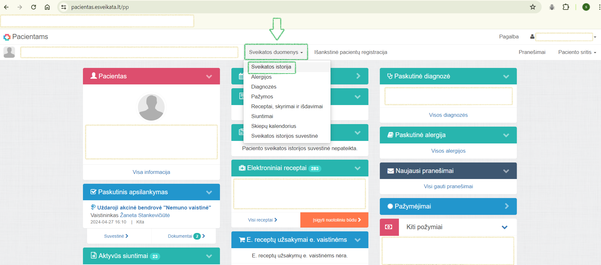
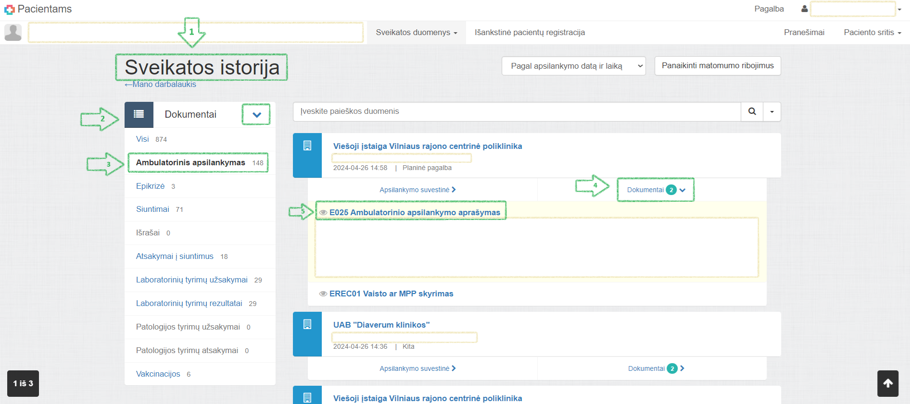
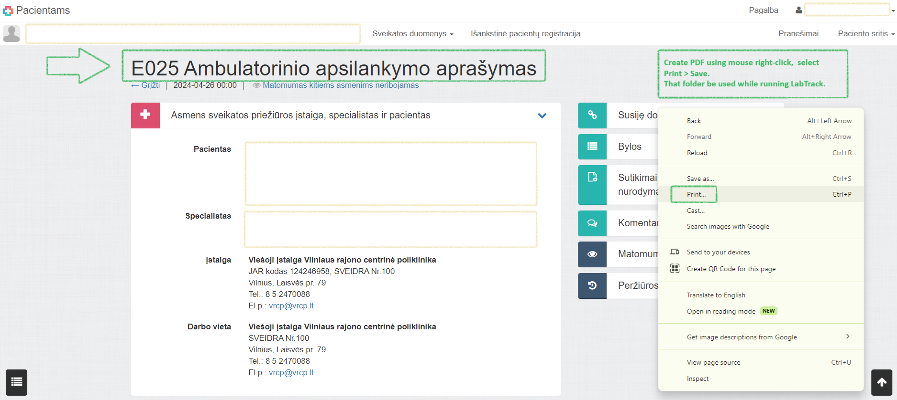

# LabTrack

https://github.com/simona-89/LabTrack.git

**LabTrack** is a basic tool that allows you to track **Hemoglobin & Ferritin** levels from your blood tests, accessible from your personal account on e-sveikata.
Users should create a folder with PDF files downloaded from their personal account at https://www.esveikata.lt/. 
LabTrack reads data from these PDFs and displays Hemoglobin & Ferritin results and levels, along with the date of analysis, in a single row if found.
This tool saves time and energy by enabling quick comparison of blood test results with previous ones.
However, LabTrack only extracts the data it finds and its not perfect due to complexity of extracting data from PDFs.
**Advice: if results are outside the normal range, users should consult their doctor for advice.**

## Table of Contents

- [Features](#features)
- [How to Run](#how-to-run)
- [How to Use](#how-to-use)
- [Dependencies](#dependencies)
- [Limitations and Future Improvements](#limitations-and-future-improvements)
- [Contact](#contact)
- [Contributions](#contributions)


## Features

**Upload your lab. test files**: Enables uploading PDF files from your computer.

**Track specific details**: Allows tracking of Hemoglobin or Ferritin results. Results and levels for each parameter are displayed in ascending order based on the report's date of issue.

**Export & Save CSV**: Saves extracted details in a CSV file on your PC, in the same folder where the PDF files were read from. The details are sorted by parameter and the report's date of issue.


## How to Run

To launch the LabTrack application, open your terminal, navigate to the directory where the main.py file is located, and execute the following command:

```bash
python main.py

```

This command initiates the application and presents the main menu as below. 
For optimal usage, please refer to the **How to Use** section for detailed instructions.

**Welcome to LabTrack**
Your personal assistant to track your blood test results.

**LabTrack is here to help you:**
[1] Upload your lab. test files
[2] Track specific details
[3] Export & Save CSV
[4] Exit
**Type selection here:**

Select the number corresponding to the feature you wish to access, or choose 'Exit' to quit. 
Please be aware that the application will continue to prompt for a valid option until one is provided. 
If an EOFError or KeyboardInterrupt occurs, the application will terminate

## How to Use

### Preparation

Before starting the application, you need to do some preparation.

1. Sign to your https://www.esveikata.lt/
2. Find & select "Sveikatos duomenys" (on the top row of the page)


3. Find & select "Sveikatos Istrija" (selection from navbar "Sveikatos duomenys")
4. Find & select "Dokumentai" (navbar on the left top)
5. Find & select "Ambulatorinis apsilankymas"
6. Notice records uploaded from your visits at clinics & hospitals (on the right side on the page)
7. Each record has sections "Apsilankymo suvestinė" & "Dokumentai"
8. Select "Dokumentai" and look for uploaded forms as "E025 Ambulatorinio apsilankymo aprašymas"


9. Open forms "E025 Ambulatorinio apsilankymo aprašymas" and use mouse right-click to create PDF (print>save)


This version of LabTrack is tested to efficiently read data from the designated forms, assuming they are saved as PDFs in the manner described.

## Dependencies
LabTrack uses external libraries as below.

- pdfminer.high_level: This is a part of the pdfminer.six library, which is a Python package for extracting text, images, metadata, and more from PDF files. It can be installed with pip.
- PyPDF2: This is a Python library for reading and writing PDF files. It can be installed with pip.
- colorama: This is a Python library for producing colored terminal text and cursor positioning on multiple platforms. It can be installed with pip.

You can install the external libraries by running:

```bash
pip install pdfminer.six
pip install PyPDF2
pip install colorama
```

## Limitations and Future Improvements

LabTrack currently has limitations in its ability to read data from specific PDF files, heavily rely on the patterns used to extract details. 
Areas for improvement include:

1. **Flexibility**: 
- The application currently supports only one type of document, created in a specific way as PDFs. 
- Future versions could enhance flexibility by supporting data extraction from tables or graph bars in PDFs.
- Additionally, exploring alternative file formats that facilitate easier data manipulation could be beneficial, considering the possibility of generating such files from https://www.esveikata.lt/.

2. **Error Handling**: 
- Improvements are needed in error handling, particularly for.json and.csv files.
- The current approach allows the app to run with valid paths but without valid PDFs, leading to uninformative outcomes and indicating poor design.Enhancing error handling and providing clearer feedback for invalid inputs are planned.

3. **Features**: 
- The app currently prints results of Hemoglobin & Ferritin in ascending order only. Future enhancements could include more presentation options for extracted data, such as colored output in the CLI to visually indicate parameter levels.
- The validated path is used to save results.csv. In the future this could be improved by allowing user to select path he wants to save the results and create file name.
- Possibility to navigate through all parameters and their categories, beyond just Hemoglobin & Ferritin, would benefit users of e.sveikata to reach and track their results more efficiently.

4. **Code Structure**: The current code structure could be imporved by reducing functions inside file_manager.py, separating them following the actions and creating different files. Refactoring and implementation of OOP could enhance code reusability and maintainability.

Please note that these improvements would require significant changes to the application's codebase and are intended for future versions of the application.

## Contact
For any issues or suggestions related to LabTrack, please contact the maintainers.

## Contributions
We welcome ideas to collaborate on the app, please contact the maintainers for more details.
